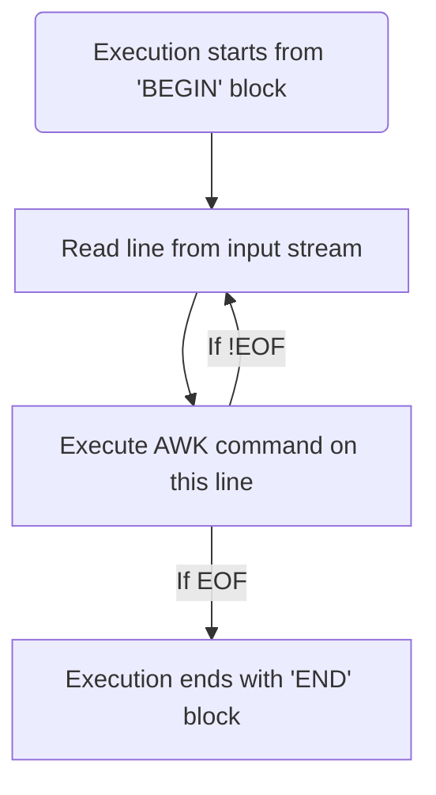

## What is AWK?

Awk is basically a scripting language used for manipulating data and generating reports. It is mostly used for pattern scanning and processing. It searches one or more files to see if they contain lines that matches with the specified patterns and then performs the associated actions. Not just penetration tester but all those who work in terminal should get comfortable with this as it saves a lot of time and effort when you know what you are doing. And the best part, **AWK never modifies the input file**! So you can be sure your input stream is safe from any modification (unless you are performing redirections from AWK of course!)

So next question is, what can AWK do? Well for starters it can:
* Read file line by line
* Find patterns in strings
* Compare patterns on each string
* Perform action(s) on those strings based on different conditions

It can do much more if you delve too deep into it but I am only going to take you through the basics which would get you up and going.

## Getting started


### AWK's Workflow



### AWK Syntax

From AWK's man page, the syntax for AWK is:

```shell
$ awk [−F sepstring] [−v assignment]... program [argument...]
```

### Print a file

To simply print a file we using AWK, the command is

```shell
$ awk '{print}' <filename>
```
> Note: If filename isn't mentioned it takes input from STDIN.

and at the first glance it does seem rather long than simply typing 

```shell
$ cat <filename>
```

But AWK isn't used to simply print a file, for that obviously cat is more handy than AWK. So now let's what makes AWK one of the most (**if not the most!**) preferable scripting language as well as command line utility for processing texts.

## Finding patterns

Let's consider a real-life scenario for a penetration tester. You get a shell back and now want to see what all users are present with a bash access. So you look at the **/etc/passwd** file...

```shell
$ cat /etc/passwd
root:x:0:0::/root:/bin/bash
nobody:x:65534:65534:Nobody:/:/usr/bin/nologin
dbus:x:81:81:System Message Bus:/:/usr/bin/nologin
...
nvidia-persistenced:x:143:143:NVIDIA Persistence Daemon:/:/usr/bin/nologin
ana:x:1005:1005:anastasia:/home/ana:/bin/bash
```
And see these many users!

### Basic word search

To find users with bash access we will run...

```shell
$ awk '/bash/ {print}' /etc/passwd
root:x:0:0::/root:/bin/bash
ceb:x:1009:1009:sebastian:/home/ceb:/bin/bash
notail:x:1002:1002:sundstein:/home/notail:/bin/bash
midone:x:1000:1000:xin:/home/midone:/bin/bash
topson:x:1004:1004:topias:/home/topson:/bin/bash
ana:x:1005:1005:anastasia:/home/ana:/bin/bash
```
It matches each line which contain the word **"bash"**

### Search using Regular Expression

AWK even supports using **regular expressions** to search for patterns. Considering the previous example, if we have to search for rows that begins with `T`, is followed by indefinite number of character and then and has `son` in it, we would do:

```shell
$ awk '/^t.*son/ {print}' /etc/passwd
topson:x:1004:1004:topias:/home/topson:/bin/bash
```

**RegEx** is an extremely powerful tool which aids in almost every domain, be it penetration testing, domain administration, database administration, network security, et cetra. I would make a seperate post about it too.

## Field Splitting

### Basic Field Splitting
Another great feature of AWK is to seperate data into fields based on a **delimiter**. This could be done by the following command:

```shell
$ awk -F <delimiter> <file>
```

This will create table like structure with each input line as a row and new column everytime the delimiter is encountered. Considering a real-life scenario, once when I was performing a pentest on a server, I came across a directory which contained around 100 folders and each folder name looked like a possible username. So I needed to extract the folder names and create a new text file with each name on a new line. So what I did was...

```shell
$ ls -l | awk -F ' ' '{print $9}' >> users.lst
$ cat users.lst
file1.name
file2.name
```

This created the required file. So how does it work? First of all, we need to know the output format of the `ls` command which is as follows:

```shell
$ ls -l
-rw-r--r--  1 root root     56 Jun 18 11:53 file1.name 
-rw-r--r--  1 root root     65 Jun 18 11:35 file2.name 
```

And here, as I have set the delimiter to be whitespace character, the AWK statement created the following table-like structure (**just for understanding!**)

|    $1        |    $2    |    $3    |    $4    |    $5    |    $6    |    $7    |    $8    |    $9    | 
|:------------:|:--------:|:--------:|----------|----------|----------|----------|----------|----------|
|  -rw-r--r--  |    1     |   root   |   root   |    56    |   Jun    |    18    |  11:53   |file1.name|
|  -rw-r--r--  |    1     |   root   |   root   |    65    |   Jun    |    18    |  11:35   |file2.name|

It should be quite clear from the above table why we chose **$9** for the command. 

### Multi-Column Print

Let's take another example. Consider a case where we want to print the users and their HOME folder. For that we can do...

```shell
$ awk -F ':' '{print $1 " -> " $6}' /etc/passwd
root -> /root
nobody -> /
...
ana -> /home/ana
```

## Inbuilt Variables

AWK has a numerous inbuilt variables which provide extra tool for power users. We won't go too deep as this is just a beginner's guide to AWK.

### ARGC

This variable contains the **number of arguments** passed to the AWK command.

```shell
$ awk 'BEGIN {print ARGC}' arg1 arg2 arg3
4
```
> **BEGIN** was used here as it doesn't require seperate input stream to run and it runs only once. Or else it would run for every line of the input stream.

It simply returned the number of arguments passed, the first argument being the command itself.


### ARGV

This variable contains the **list of arguments passed** to the AWK command ranging from **0** to **ARGC-1**.

```shell
$ awk 'BEGIN {print ARGV[0]}' arg1 arg2 arg3
awk
$ awk 'BEGIN {print ARGV[3]}' arg1 arg2 arg3
arg3
```

### NR

NR represents **Number of current Record**. It could be easily understood as the line number starting from 1.

```shell
$ awk -F ':' '{print NR ":" $1 " -> " $6}' /etc/passwd
1:root -> /root
2:nobody -> /
...
31:ana -> /home/ana
```

### ENVIRON

As the name suggest, it is used to access the array of **environment variables**.

```shell
$ awk 'BEGIN {print ENVIRON["PATH"]}'
/home/ana/.gem/ruby/2.7.0/bin:/home/ana/.local/bin:/home/ana/.gem/ruby/2.7.0/bin:/home/ana/.gem/ruby/2.7.0/bin:/home/ana/.local/bin:/usr/local/sbin:/usr/local/bin:/usr/bin:/usr/lib/jvm/default/bin:/usr/bin/site_perl:/usr/bin/vendor_perl:/usr/bin/core_perl:/var/lib/snapd/snap/bin:/usr/lib/jvm/default/bin:/usr/bin/site_perl:/usr/bin/vendor_perl:/usr/bin/core_perl
```

### FILENAME

As the name suggest it prints the name of the file passed to it
```shell
$ awk 'END {print FILENAME}' /etc/passwd
/etc/passwd
$ ls -l | awk 'END {print FILENAME}'
-
```
> Can you think why we used **END** here and not **BEGIN**? HINT: Look at the workflow

In the second example, since we send the STDIN into AWK, the output was **-** (which represents STDIN)

### FS

FS represents the **Field Seperator** whose default value is a space. We can change its value with the **-F** parameter as shown previously.

```shell
$ awk '{print FS}' | cat -e
 $
```
We used `cat -e` to show the non-printable characters such as the **$** symbol which comes at the end of each line, without which we couldn't have known that there is a whitespace printed.

## Substitution

One other useful option provided by AWK is **pattern substitution**. There are numerous ways to make this happen and we are going to see the most common ones.

### Changing FS

One of the basic task is to change the Field Seperator. To do this we run:

```shell
$ awk '$1=$1' FS=":" OFS="\t" /etc/passwd
root    x       0       0               /root   /bin/bash
nobody  x       65534   65534   Nobody  /       /usr/bin/nologin
...
midone  x       1005    1005    xin     /home/midone     /bin/bash
```
We used `'$1=$1'` because it forces AWK to rebuild the record because simple using `{print}` doesn't change the record! According to the GNU's manual...

`manual`{:.info}

> **Understanding $0:**
It is important to remember that $0 is the full record, exactly as it was read from the input. This includes any leading or trailing whitespace, and the exact whitespace (or other characters) that separates the fields.
It is a common error to try to change the field separators in a record simply by setting FS and OFS, and then expecting a plain ‘print’ or ‘print $0’ to print the modified record.
But this does not work, because nothing was done to change the record itself. Instead, you must force the record to be rebuilt, typically with a statement such as ‘$1 = $1’, as described earlier.

You can read more about it [here](https://www.gnu.org/software/gawk/manual/html_node/Changing-Fields.html).

### GSUB

GSUB stands for **global substitution** and it replaces every occurrence found with another specified word. For example:

```shell
ls -l | awk 'gsub("4096","0000")'
total 56
drwxr-xr-x 2 ana ana 0000 Jun 10 17:40 Desktop
drwxr-xr-x 6 ana ana 0000 Jun 15 21:31 Documents
drwxr-xr-x 3 ana ana 0000 Jun 18 00:19 Downloads
drwxr-x--- 4 ana ana 0000 May 31 14:22 Ghidra
drwxr-x--- 2 ana ana 0000 May 30 16:39 ghidra_scripts
drwxr-xr-x 9 ana ana 0000 Jun 18 11:52 GitHub
drwxr-xr-x 9 ana ana 0000 Jun 10 12:20 HTB
drwxr-xr-x 2 ana ana 0000 May 29 00:39 logs
drwxr-xr-x 2 ana ana 0000 May 28 15:38 Music
drwxr-xr-x 2 ana ana 0000 Jun  5 14:34 Pictures
drwxr-xr-x 3 ana ana 0000 May 29 00:48 Public
drwxr-xr-x 2 ana ana 0000 May 28 06:48 Videos
```

## Conclusion

This isn't even the tip of the iceberg when it comes to AWK, it's a whole scripting language in itself with which we can create loops, multi-dimensional arrays, manipulate bits, and what not! But this guide should be useful just for all those who have an interest in AWK but didn't know where to start from, or for those who spent long duration of time to modify texts manually. 

<!--more-->
 
---

