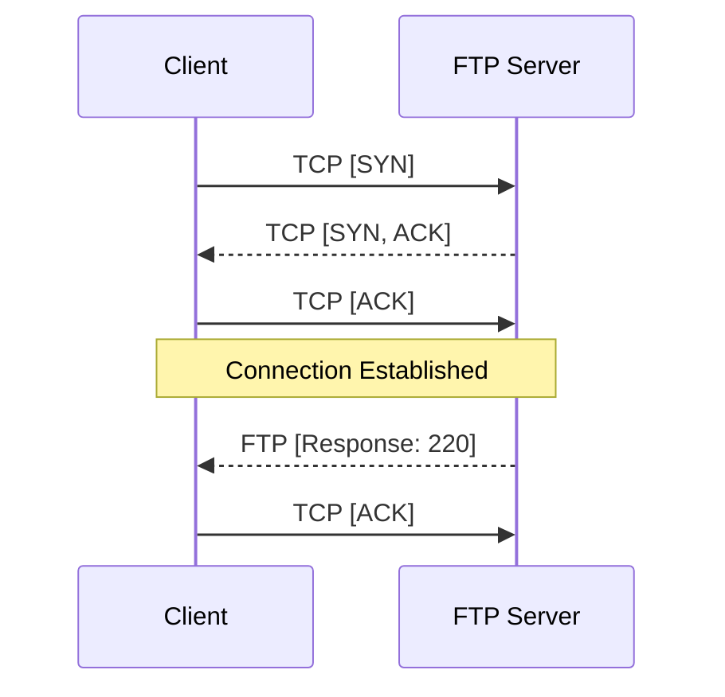
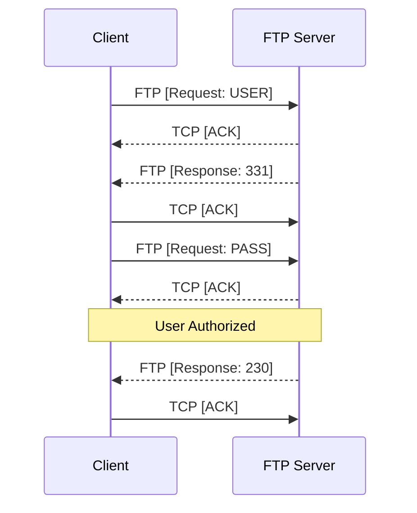
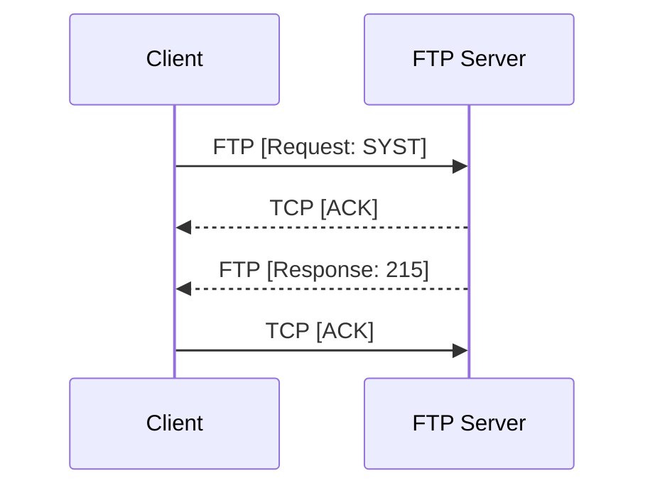
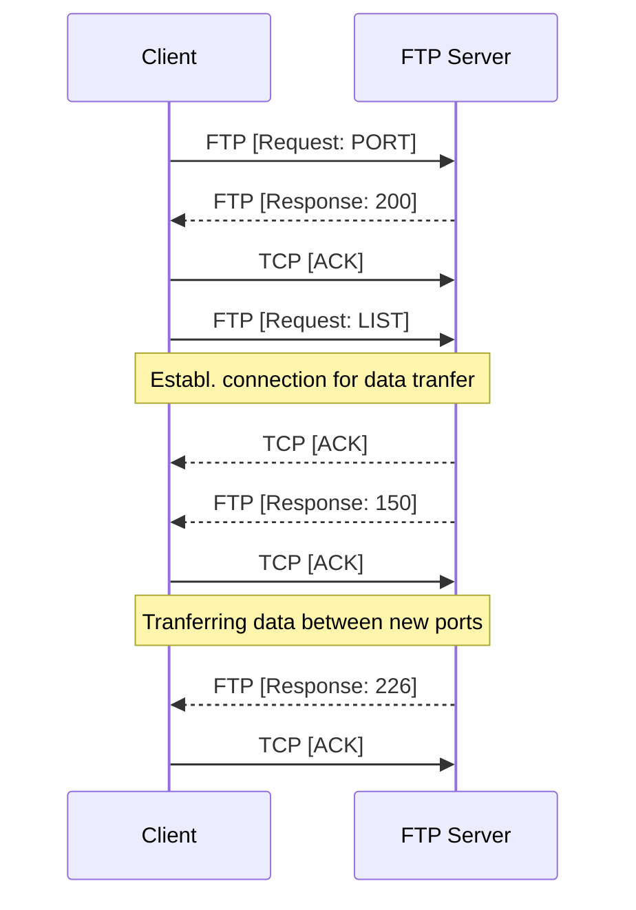
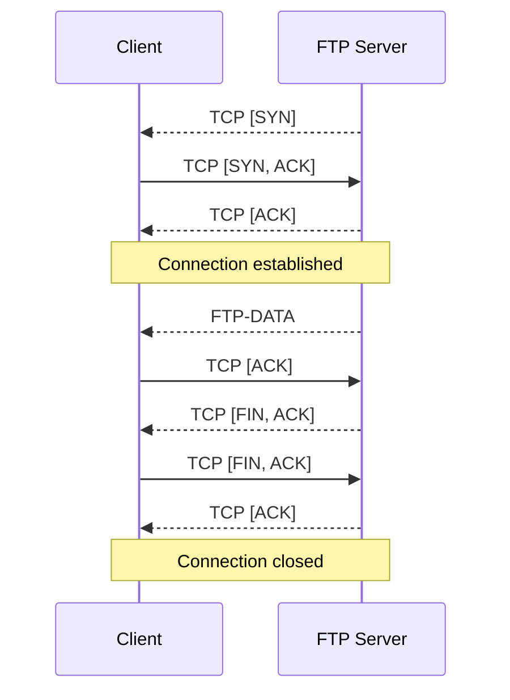
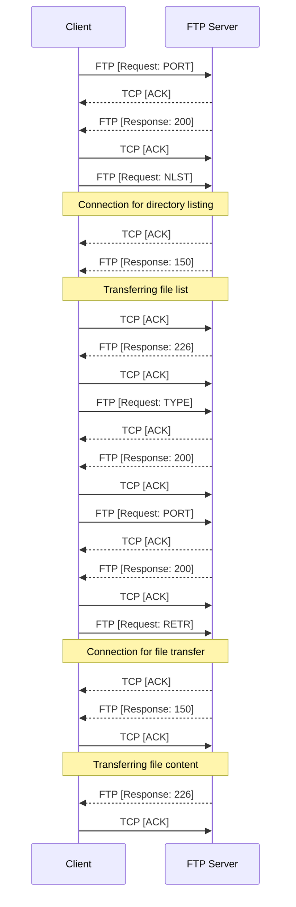
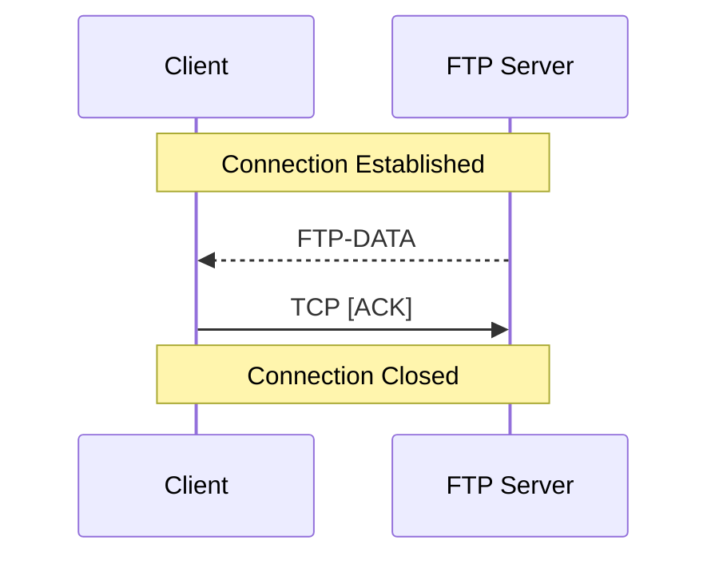
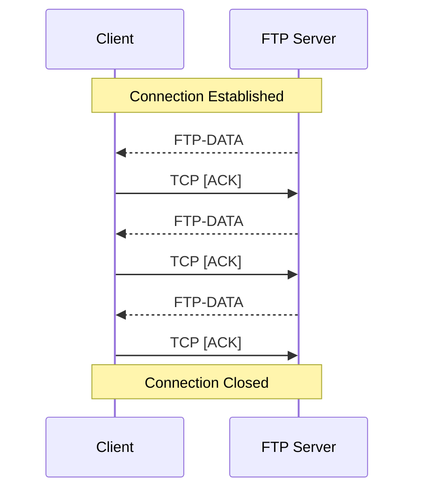
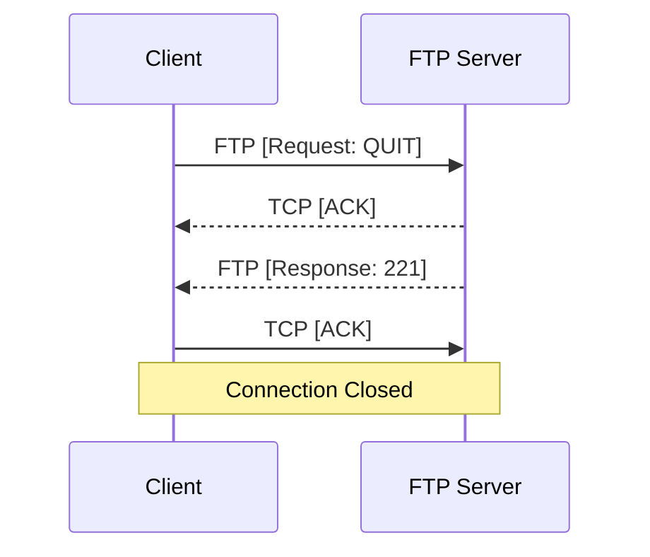

## What is Wireshark?

Before anything else, know this: **Wireshark is an extremely powerful tool!** It allows one to see what's happening in a network, and it does this by showing all the traffic on an interface. It literally just dumps each and every packet going across the network. Well, not **just** dump them but also:
* Capture live packets.
* Import packets from text files containing hex dumps of packet data.
* Display detailed protocol information of each packet.
* Filter packets based on (multiple) criteria.
* Create various statistics
* Colourise packets for easy identification

... and much more!

As a competent penetration tester, network security engineer or a network adminitrator, you should be well-versed with Wireshark (or any packet sniffer in general).  

## Getting started

There are two ways to use Wireshark: Using the GUI or the CLI. And we are going to learn the GUI version as it is easier to learn and understand.

### Prerequisites

There is one major requirement before getting started with any packet sniffer, which it to have a **solid understanding of the TCP/IP Model**, which should be pretty obvious as to why? It is because Wireshark shows packets carrying data from all the various layers from one system onto another system, which you, as an expert (or an enthusiast) are going to analyze.

### Wireshark GUI

When you open Wireshark, the main screen will be divided into two broad section: "Open" and "Capture"

<div class="card">
  <div class="card__image">
    
    <div class="overlay">
      <p>Interfaces recognised by Wireshark</p>
    </div>
  </div>
</div>

The "Open" section lets you open the previously saved captures (which will be blank if you opened wireshark the first time) and the "Capture" section lets you capture the traffic from a particular interface. You can notice that these are the same interfaces you see when you run the command `ip addr`

```shell
$ ip addr
1: lo: <LOOPBACK,UP,LOWER_UP> mtu 65536 qdisc noqueue state UNKNOWN group default qlen 1000
    link/loopback 00:00:00:00:00:00 brd 00:00:00:00:00:00
    inet 127.0.0.1/8 scope host lo
       valid_lft forever preferred_lft forever
    inet6 ::1/128 scope host 
       valid_lft forever preferred_lft forever
2: enp3s0: <NO-CARRIER,BROADCAST,MULTICAST,UP> mtu 1500 qdisc fq_codel state DOWN group default qlen 1000
    link/ether d4:81:d7:ae:cc:41 brd ff:ff:ff:ff:ff:ff
3: wlp2s0: <BROADCAST,MULTICAST,UP,LOWER_UP> mtu 1500 qdisc noqueue state UP group default qlen 1000
    link/ether 3c:f8:62:f4:b2:6c brd ff:ff:ff:ff:ff:ff
    inet 192.168.43.26/24 brd 192.168.43.255 scope global dynamic noprefixroute wlp2s0
       valid_lft 2080sec preferred_lft 2080sec
    inet6 2405:204:8387:6e5b:751a:4914:e6a6:c2d9/64 scope global dynamic noprefixroute 
       valid_lft 3416sec preferred_lft 3416sec
    inet6 fe80::3a04:1960:74fe:21c5/64 scope link noprefixroute 
       valid_lft forever preferred_lft forever
```

The most common interfaces woulb be 'wlan0' for wireless connection and 'eth0' for ethernet connection. And if you don't know what you are doing and just open 'any' interface, you'll be overwhelmed by the amount of "noise" in the network (See the video below). In order to facilitate the analysis, we should apply **capture filters** and **display filters**

<video width="100%" height="100%" style="border-radius:6px;" controls autoplay muted loop>
  <source src="/assets/test.mp4" type="video/mp4">
</video>

## Filters

As the name suggests, filters are a collection of strings used to filter out data (that's the best explanation I can come up with in as little as possible)

### Capture Filters

Capture filter are filters used to reduce the number of packets captured. As shown in the video above, Wireshark (by default) captures each and every packet flowing in the network. This might not be ideal in some situations, so we can reduce the number of packets captured by applying capture filters. You can see the capture filter box in the interface section in the first photo.

Some of the most simple but useful capture filters are:

* **Filtering based on port**

```python
tcp port 80
```

With this filter, only http packets will be captured to and from the network.

* **Filtering based on originating IP address(es)**

```python
src net 192.168.0.0/24
```
> We can also use subnet mask we don't want to use CIDR notation.

This filter helps us to capture packets originating from a whole subnet given by the CIDR notation. This could be useful when you know the malicious activity is being performed from a system in a particular subnet and you need to filter out the rest of the packets.


* **Filtering based on host and port**

```python
host www.example.com and not (port 80 or port 25)
```

This is also useful if you have a server which only has a website hosted and a FTP share. So if any other port is accessed, you know something's wrong.

### Display Filters

Display Filters are those filters which work on pre-captured packets. That is to say that they dont 'capture' packets based on some criteria, but rather just 'display' those specific packets filtered by the argument. Consider this example for a better understanding: Say that a total of 1000 packets are gonna flow for a particular activity on the network, out of which 400 packets are from IP **10.0.0.1** and the rest 600 are from IP **10.0.0.2**
* If we apply capture filter `src 10.0.0.1`, only 400 packets are going to be captured by the wireshark, and the rest will be discarded.
* But if we apply equivalent display filter `ip.src == 10.0.0.1`, all 1000 packets will be captured but only that 400 will be displayed. Once you remove this filter, all 1000 packets will be displayed again.

So the equivalent display filters for the above capture filters would be:

* **Filtering based on port**

```python
tcp.port == 80
```

* **Filtering based on originating IP address(es)**

```python
ip.src == 192.168.0.0/24
```

* **Filtering based on host and port**

```python
ip.host == www.example.com
```

## FTP Packet Analysis

Now that the basics of Wireshark is done, let's start with the hands-on. We will be examining a [Wireshark capture](https://github.com/xmehulx/wireshark-samples/raw/master/ftp_20-21.pcap) between my system and a remote system with FTP service enabled. (You can download this packet capture if you want to). 

`Note`{:.info}
> This is an active FTP session (not passive) and passive FTP session would be covered later.

The FTP session conversation was this:

```python
$ ftp 10.10.10.187
Connected to 10.10.10.187.
220 (vsFTPd 3.0.3)
Name (10.10.10.187:root): ftpuser
331 Please specify the password.
Password:
230 Login successful.
Remote system type is UNIX.
Using binary mode to transfer files.
ftp> ls
200 PORT command successful. Consider using PASV.
150 Here comes the directory listing.
-rw-r--r--    1 0        0            3405 Dec 02  2019 dump.sql
-rw-r--r--    1 0        0         5270987 Dec 03  2019 html.tar.gz
226 Directory send OK.
ftp> mget dump.sql
mget dump.sql? yes
200 PORT command successful. Consider using PASV.
150 Opening BINARY mode data connection for dump.sql (3405 bytes).
226 Transfer complete.
3405 bytes received in 0.00 secs (16.1555 MB/s)
ftp> quit
221 Goodbye.
```

And the packet log is shown below


So let's go over each and every command and see what's happening. The client IP in this case was **10.10.15.211** and the FTP server was hosted on the machine with IP **10.10.10.187**

### TCP Handshake

When we type in the command `ftp 10.10.10.187` we are immediately shown the following output:

```python
$ ftp 10.10.10.187
Connected to 10.10.10.187.
220 (vsFTPd 3.0.3)
```

It shows "connected", but before any TCP connection is established, a 3-way handshake was performed as it can be seen with the captured packets.

```python
  1 10.10.15.211 → 10.10.10.187 TCP 60 47050 → 21 [SYN] Seq=0 Win=64240 Len=0 MSS=1460 SACK_PERM=1 TSval=3745094911 TSecr=0 WS=128
  2 10.10.10.187 → 10.10.15.211 TCP 60 21 → 47050 [SYN, ACK] Seq=0 Ack=1 Win=28960 Len=0 MSS=1357 SACK_PERM=1 TSval=3049545 TSecr=3745094911 WS=128
  3 10.10.15.211 → 10.10.10.187 TCP 52 47050 → 21 [ACK] Seq=1 Ack=1 Win=64256 Len=0 TSval=3745095573 TSecr=3049545
  4 10.10.10.187 → 10.10.15.211 FTP 72 Response: 220 (vsFTPd 3.0.3)
  5 10.10.15.211 → 10.10.10.187 TCP 52 47050 → 21 [ACK] Seq=1 Ack=21 Win=64256 Len=0 TSval=3745096034 TSecr=3049709
```

The first three packets of the capture is the 3-way handhshake, highlighted with grey in Wireshark, which can be seen with the `tshark` output above. The fourth packet is the FTP banner sent by the remote server and the fifth is the acknowledgment of the previous packet. This can be summarized with the following sequence diagram.




and this is the output in the terminal when the connection has been established

### Login Credentials

When the connection has been established, The FTP asks for username and password:

```python
Name (10.10.10.187:root): ftpuser
331 Please specify the password.
Password:
```

And the corresponding packets for this interaction were...

```python
  6 10.10.15.211 → 10.10.10.187 FTP 66 Request: USER ftpuser
  7 10.10.10.187 → 10.10.15.211 TCP 52 21 → 47050 [ACK] Seq=21 Ack=15 Win=29056 Len=0 TSval=3050418 TSecr=3745098416
  8 10.10.10.187 → 10.10.15.211 FTP 86 Response: 331 Please specify the password.
  9 10.10.15.211 → 10.10.10.187 TCP 52 47050 → 21 [ACK] Seq=15 Ack=55 Win=64256 Len=0 TSval=3745098626 TSecr=3050418
 10 10.10.15.211 → 10.10.10.187 FTP 72 Request: PASS %n?4Wz}R$tTF7
 11 10.10.10.187 → 10.10.15.211 TCP 52 21 → 47050 [ACK] Seq=55 Ack=35 Win=29056 Len=0 TSval=3050972 TSecr=3745100590
 12 10.10.10.187 → 10.10.15.211 FTP 75 Response: 230 Login successful.
 13 10.10.15.211 → 10.10.10.187 TCP 52 47050 → 21 [ACK] Seq=35 Ack=78 Win=64256 Len=0 TSval=3745100863 TSecr=3050978
```

From the above output we can formulate the given sequence diagram for the packet flow.



And once authorized, our system issued a `SYST` command to ask the system type of the remote server.

```python
Remote system type is UNIX.
Using binary mode to transfer files.
```

We couldn't have known this if we didn't see the packets being transferred, and the packets that gave this output were:

```python
 14 10.10.15.211 → 10.10.10.187 FTP 58 Request: SYST
 15 10.10.10.187 → 10.10.15.211 TCP 52 21 → 47050 [ACK] Seq=78 Ack=41 Win=29056 Len=0 TSval=3051023 TSecr=3745100864
 16 10.10.10.187 → 10.10.15.211 FTP 71 Response: 215 UNIX Type: L8
 17 10.10.15.211 → 10.10.10.187 TCP 52 47050 → 21 [ACK] Seq=41 Ack=97 Win=64256 Len=0 TSval=3745101404 TSecr=3051023
```

To represent it in a sequence diagram...



### Directory Listing

After being authorized, I performed the simplest command, that is `ls` which gave the following output:

```python
ftp> ls
200 PORT command successful. Consider using PASV.
150 Here comes the directory listing.
-rw-r--r--    1 0        0            3405 Dec 02  2019 dump.sql
-rw-r--r--    1 0        0         5270987 Dec 03  2019 html.tar.gz
226 Directory send OK.
```

Surprisingly, behind such a simple command, a series of packets are transferred:

```python
 18 10.10.15.211 → 10.10.10.187 FTP 79 Request: PORT 10,10,15,211,158,215
 19 10.10.10.187 → 10.10.15.211 FTP 103 Response: 200 PORT command successful. Consider using PASV.
 20 10.10.15.211 → 10.10.10.187 TCP 52 47050 → 21 [ACK] Seq=68 Ack=148 Win=64256 Len=0 TSval=3745103584 TSecr=3051535
 21 10.10.15.211 → 10.10.10.187 FTP 58 Request: LIST
 22 10.10.10.187 → 10.10.15.211 TCP 60 20 → 40663 [SYN] Seq=0 Win=29200 Len=0 MSS=1357 SACK_PERM=1 TSval=3051710 TSecr=0 WS=128
 23 10.10.15.211 → 10.10.10.187 TCP 60 40663 → 20 [SYN, ACK] Seq=0 Ack=1 Win=65160 Len=0 MSS=1460 SACK_PERM=1 TSval=3745104034 TSecr=3051710 WS=128
 24 10.10.10.187 → 10.10.15.211 TCP 52 21 → 47050 [ACK] Seq=148 Ack=74 Win=29056 Len=0 TSval=3051721 TSecr=3745103584
 25 10.10.10.187 → 10.10.15.211 TCP 52 20 → 40663 [ACK] Seq=1 Ack=1 Win=29312 Len=0 TSval=3051815 TSecr=3745104034
 26 10.10.10.187 → 10.10.15.211 FTP 91 Response: 150 Here comes the directory listing.
 27 10.10.15.211 → 10.10.10.187 TCP 52 47050 → 21 [ACK] Seq=74 Ack=187 Win=64256 Len=0 TSval=3745104213 TSecr=3051815
 28 10.10.10.187 → 10.10.15.211 FTP-DATA 187 FTP Data: 135 bytes (PORT) (LIST)
 29 10.10.15.211 → 10.10.10.187 TCP 52 40663 → 20 [ACK] Seq=1 Ack=136 Win=65152 Len=0 TSval=3745104213 TSecr=3051815
 30 10.10.10.187 → 10.10.15.211 TCP 52 20 → 40663 [FIN, ACK] Seq=136 Ack=1 Win=29312 Len=0 TSval=3051815 TSecr=3745104034
 31 10.10.15.211 → 10.10.10.187 TCP 52 40663 → 20 [FIN, ACK] Seq=1 Ack=137 Win=65152 Len=0 TSval=3745104214 TSecr=3051815
 32 10.10.10.187 → 10.10.15.211 FTP 76 Response: 226 Directory send OK.
 33 10.10.15.211 → 10.10.10.187 TCP 52 47050 → 21 [ACK] Seq=74 Ack=211 Win=64256 Len=0 TSval=3745104673 TSecr=3051863
 34 10.10.10.187 → 10.10.15.211 TCP 52 20 → 40663 [ACK] Seq=137 Ack=2 Win=29312 Len=0 TSval=3051863 TSecr=3745104214
```

So let's go over the packets one by one:
1. Initially, the client issues a `PORT` command used to initiate a data connection to transfer data. The command include information on the address and port the server should use to connect back to the client. The structure of data is: **PORT (x1,x2,x3,x4,p1,p2)**, where the address where the server should respond to is **x1.x2.x3.x4** and the port should be **(p1 x 256) + p2**. In this case the the address is **10.10.15.211** and port is (158 x 256) + 215 = **40663**.
2. The client then issues a `LIST` command to get the list of files and directories.
3. Then, the server connects to the above mentioned port (usually from port 20) to initiate data tranfer.
4. Once the data is transferred, the connection is closed to the data stream.

So, to understand it better, we'll be dividing it into two different diagrams. One, the formalities that need to be done to initiate the transfer and second, the data transfer itself.

First, the formalities:

```python
 18 10.10.15.211 → 10.10.10.187 FTP 79 Request: PORT 10,10,15,211,158,215
 19 10.10.10.187 → 10.10.15.211 FTP 103 Response: 200 PORT command successful. Consider using PASV.
 20 10.10.15.211 → 10.10.10.187 TCP 52 47050 → 21 [ACK] Seq=68 Ack=148 Win=64256 Len=0 TSval=3745103584 TSecr=3051535
 21 10.10.15.211 → 10.10.10.187 FTP 58 Request: LIST
 24 10.10.10.187 → 10.10.15.211 TCP 52 21 → 47050 [ACK] Seq=148 Ack=74 Win=29056 Len=0 TSval=3051721 TSecr=3745103584
 26 10.10.10.187 → 10.10.15.211 FTP 91 Response: 150 Here comes the directory listing.
 27 10.10.15.211 → 10.10.10.187 TCP 52 47050 → 21 [ACK] Seq=74 Ack=187 Win=64256 Len=0 TSval=3745104213 TSecr=3051815
 32 10.10.10.187 → 10.10.15.211 FTP 76 Response: 226 Directory send OK.
 33 10.10.15.211 → 10.10.10.187 TCP 52 47050 → 21 [ACK] Seq=74 Ack=211 Win=64256 Len=0 TSval=3745104673 TSecr=3051863
```
And its corresponding sequence diagram


Then, the data transfer:

```python
 22 10.10.10.187 → 10.10.15.211 TCP 60 20 → 40663 [SYN] Seq=0 Win=29200 Len=0 MSS=1357 SACK_PERM=1 TSval=3051710 TSecr=0 WS=128
 23 10.10.15.211 → 10.10.10.187 TCP 60 40663 → 20 [SYN, ACK] Seq=0 Ack=1 Win=65160 Len=0 MSS=1460 SACK_PERM=1 TSval=3745104034 TSecr=3051710 WS=128
 25 10.10.10.187 → 10.10.15.211 TCP 52 20 → 40663 [ACK] Seq=1 Ack=1 Win=29312 Len=0 TSval=3051815 TSecr=3745104034
 28 10.10.10.187 → 10.10.15.211 FTP-DATA 187 FTP Data: 135 bytes (PORT) (LIST)
 29 10.10.15.211 → 10.10.10.187 TCP 52 40663 → 20 [ACK] Seq=1 Ack=136 Win=65152 Len=0 TSval=3745104213 TSecr=3051815
 30 10.10.10.187 → 10.10.15.211 TCP 52 20 → 40663 [FIN, ACK] Seq=136 Ack=1 Win=29312 Len=0 TSval=3051815 TSecr=3745104034
 31 10.10.15.211 → 10.10.10.187 TCP 52 40663 → 20 [FIN, ACK] Seq=1 Ack=137 Win=65152 Len=0 TSval=3745104214 TSecr=3051815
 34 10.10.10.187 → 10.10.15.211 TCP 52 20 → 40663 [ACK] Seq=137 Ack=2 Win=29312 Len=0 TSval=3051863 TSecr=3745104214
```
and its corresponding sequence diagram


All this was happening just to display the contents of a folder! 

`Note`{:.info}
> From now on, I would simply be using **"Connection established"** and **"Connection closed"** for the 3-way handshake

### File Download

After listing the directory contents, I downloaded the file named **dump.sql** using the command `mget` (I know I could have used `get` but it's a habit now to use `mget` all the time):

```python
ftp> mget dump.sql
mget dump.sql? yes
200 PORT command successful. Consider using PASV.
150 Opening BINARY mode data connection for dump.sql (3405 bytes).
226 Transfer complete.
3405 bytes received in 0.00 secs (16.1555 MB/s)
```

And the corresponding packets for this were:

```python
 35 10.10.15.211 → 10.10.10.187 FTP 79 Request: PORT 10,10,15,211,172,161                                                                                                   
 36 10.10.10.187 → 10.10.15.211 TCP 52 21 → 47050 [ACK] Seq=211 Ack=101 Win=29056 Len=0 TSval=3053605 TSecr=3745111165                                                      
 37 10.10.10.187 → 10.10.15.211 FTP 103 Response: 200 PORT command successful. Consider using PASV.                                                                         
 38 10.10.15.211 → 10.10.10.187 TCP 52 47050 → 21 [ACK] Seq=101 Ack=262 Win=64256 Len=0 TSval=3745111393 TSecr=3053605                                                      
 39 10.10.15.211 → 10.10.10.187 FTP 67 Request: NLST dump.sql                                                                                                               
 40 10.10.10.187 → 10.10.15.211 TCP 60 20 → 44193 [SYN] Seq=0 Win=29200 Len=0 MSS=1357 SACK_PERM=1 TSval=3053655 TSecr=0 WS=128                                             
 41 10.10.15.211 → 10.10.10.187 TCP 60 44193 → 20 [SYN, ACK] Seq=0 Ack=1 Win=65160 Len=0 MSS=1460 SACK_PERM=1 TSval=3745111712 TSecr=3053655 WS=128                         
 42 10.10.10.187 → 10.10.15.211 TCP 52 21 → 47050 [ACK] Seq=262 Ack=116 Win=29056 Len=0 TSval=3053666 TSecr=3745111393                                                      
 43 10.10.10.187 → 10.10.15.211 TCP 52 20 → 44193 [ACK] Seq=1 Ack=1 Win=29312 Len=0 TSval=3053738 TSecr=3745111712                                                          
 44 10.10.10.187 → 10.10.15.211 FTP 91 Response: 150 Here comes the directory listing.                                                                                      
 45 10.10.10.187 → 10.10.15.211 FTP-DATA 62 FTP Data: 10 bytes (PORT) (NLST dump.sql) 
 46 10.10.15.211 → 10.10.10.187 TCP 52 44193 → 20 [ACK] Seq=1 Ack=11 Win=65152 Len=0 TSval=3745112099 TSecr=3053738
 47 10.10.10.187 → 10.10.15.211 TCP 52 20 → 44193 [FIN, ACK] Seq=11 Ack=1 Win=29312 Len=0 TSval=3053738 TSecr=3745111712
 48 10.10.15.211 → 10.10.10.187 TCP 52 44193 → 20 [FIN, ACK] Seq=1 Ack=12 Win=65152 Len=0 TSval=3745112099 TSecr=3053738
 49 10.10.15.211 → 10.10.10.187 TCP 52 47050 → 21 [ACK] Seq=116 Ack=301 Win=64256 Len=0 TSval=3745112139 TSecr=3053738
 50 10.10.10.187 → 10.10.15.211 TCP 52 20 → 44193 [ACK] Seq=12 Ack=2 Win=29312 Len=0 TSval=3053833 TSecr=3745112099
 51 10.10.10.187 → 10.10.15.211 FTP 76 Response: 226 Directory send OK.
 52 10.10.15.211 → 10.10.10.187 TCP 52 47050 → 21 [ACK] Seq=116 Ack=325 Win=64256 Len=0 TSval=3745112284 TSecr=3053833
 53 10.10.15.211 → 10.10.10.187 FTP 60 Request: TYPE I
 54 10.10.10.187 → 10.10.15.211 TCP 52 21 → 47050 [ACK] Seq=325 Ack=124 Win=29056 Len=0 TSval=3054339 TSecr=3745114086
 55 10.10.10.187 → 10.10.15.211 FTP 83 Response: 200 Switching to Binary mode.
 56 10.10.15.211 → 10.10.10.187 TCP 52 47050 → 21 [ACK] Seq=124 Ack=356 Win=64256 Len=0 TSval=3745114308 TSecr=3054339
 57 10.10.15.211 → 10.10.10.187 FTP 79 Request: PORT 10,10,15,211,150,145
 58 10.10.10.187 → 10.10.15.211 FTP 103 Response: 200 PORT command successful. Consider using PASV.
 59 10.10.15.211 → 10.10.10.187 TCP 52 47050 → 21 [ACK] Seq=151 Ack=407 Win=64256 Len=0 TSval=3745114486 TSecr=3054383
 60 10.10.15.211 → 10.10.10.187 FTP 67 Request: RETR dump.sql
 61 10.10.10.187 → 10.10.15.211 TCP 60 20 → 38545 [SYN] Seq=0 Win=29200 Len=0 MSS=1357 SACK_PERM=1 TSval=3054429 TSecr=0 WS=128
 62 10.10.15.211 → 10.10.10.187 TCP 60 38545 → 20 [SYN, ACK] Seq=0 Ack=1 Win=65160 Len=0 MSS=1460 SACK_PERM=1 TSval=3745115099 TSecr=3054429 WS=128
 63 10.10.10.187 → 10.10.15.211 TCP 52 21 → 47050 [ACK] Seq=407 Ack=166 Win=29056 Len=0 TSval=3054440 TSecr=3745114486
 64 10.10.10.187 → 10.10.15.211 TCP 52 20 → 38545 [ACK] Seq=1 Ack=1 Win=29312 Len=0 TSval=3054586 TSecr=3745115099
 65 10.10.10.187 → 10.10.15.211 FTP 120 Response: 150 Opening BINARY mode data connection for dump.sql (3405 bytes).
 66 10.10.15.211 → 10.10.10.187 TCP 52 47050 → 21 [ACK] Seq=166 Ack=475 Win=64256 Len=0 TSval=3745115554 TSecr=3054586
 67 10.10.10.187 → 10.10.15.211 FTP-DATA 1397 FTP Data: 1345 bytes (PORT) (RETR dump.sql)
 68 10.10.15.211 → 10.10.10.187 TCP 52 38545 → 20 [ACK] Seq=1 Ack=1346 Win=64128 Len=0 TSval=3745115555 TSecr=3054586
 69 10.10.10.187 → 10.10.15.211 FTP-DATA 1397 FTP Data: 1345 bytes (PORT) (RETR dump.sql)
 70 10.10.15.211 → 10.10.10.187 TCP 52 38545 → 20 [ACK] Seq=1 Ack=2691 Win=63232 Len=0 TSval=3745115555 TSecr=3054586
 71 10.10.10.187 → 10.10.15.211 FTP-DATA 767 FTP Data: 715 bytes (PORT) (RETR dump.sql)
 72 10.10.15.211 → 10.10.10.187 TCP 52 38545 → 20 [ACK] Seq=1 Ack=3406 Win=62592 Len=0 TSval=3745115555 TSecr=3054586
 73 10.10.10.187 → 10.10.15.211 TCP 52 20 → 38545 [FIN, ACK] Seq=3406 Ack=1 Win=29312 Len=0 TSval=3054586 TSecr=3745115099
 74 10.10.15.211 → 10.10.10.187 TCP 52 38545 → 20 [FIN, ACK] Seq=1 Ack=3407 Win=64128 Len=0 TSval=3745115556 TSecr=3054586
 75 10.10.10.187 → 10.10.15.211 TCP 52 20 → 38545 [ACK] Seq=3407 Ack=2 Win=29312 Len=0 TSval=3054695 TSecr=3745115556
 76 10.10.10.187 → 10.10.15.211 FTP 76 Response: 226 Transfer complete.
 77 10.10.15.211 → 10.10.10.187 TCP 52 47050 → 21 [ACK] Seq=166 Ack=499 Win=64256 Len=0 TSval=3745116090 TSecr=3054695
```

`mget` command too invokes series of different commands to download a file, which are:

1. **PORT** command to open new connection for data transfer to list the file name.
2. **NLST** command to list the file.
3. **TYPE** command to change the transfer type (in this case into binary).
4. **PORT** command again for data transfer. This time to transfer file contents.
5. **RETR** command to get the file contents.

Let's look at each one of them, starting from outermost:

**1. The Invoking of Requests**

```python
 35 10.10.15.211 → 10.10.10.187 FTP 79 Request: PORT 10,10,15,211,172,161
 36 10.10.10.187 → 10.10.15.211 TCP 52 21 → 47050 [ACK] Seq=211 Ack=101 Win=29056 Len=0 TSval=3053605 TSecr=3745111165
 37 10.10.10.187 → 10.10.15.211 FTP 103 Response: 200 PORT command successful. Consider using PASV.
 38 10.10.15.211 → 10.10.10.187 TCP 52 47050 → 21 [ACK] Seq=101 Ack=262 Win=64256 Len=0 TSval=3745111393 TSecr=3053605
 39 10.10.15.211 → 10.10.10.187 FTP 67 Request: NLST dump.sql
 42 10.10.10.187 → 10.10.15.211 TCP 52 21 → 47050 [ACK] Seq=262 Ack=116 Win=29056 Len=0 TSval=3053666 TSecr=3745111393
 44 10.10.10.187 → 10.10.15.211 FTP 91 Response: 150 Here comes the directory listing.
 49 10.10.15.211 → 10.10.10.187 TCP 52 47050 → 21 [ACK] Seq=116 Ack=301 Win=64256 Len=0 TSval=3745112139 TSecr=3053738
 51 10.10.10.187 → 10.10.15.211 FTP 76 Response: 226 Directory send OK.
 52 10.10.15.211 → 10.10.10.187 TCP 52 47050 → 21 [ACK] Seq=116 Ack=325 Win=64256 Len=0 TSval=3745112284 TSecr=3053833
 53 10.10.15.211 → 10.10.10.187 FTP 60 Request: TYPE I
 54 10.10.10.187 → 10.10.15.211 TCP 52 21 → 47050 [ACK] Seq=325 Ack=124 Win=29056 Len=0 TSval=3054339 TSecr=3745114086
 55 10.10.10.187 → 10.10.15.211 FTP 83 Response: 200 Switching to Binary mode.
 56 10.10.15.211 → 10.10.10.187 TCP 52 47050 → 21 [ACK] Seq=124 Ack=356 Win=64256 Len=0 TSval=3745114308 TSecr=3054339
 57 10.10.15.211 → 10.10.10.187 FTP 79 Request: PORT 10,10,15,211,150,145
 58 10.10.10.187 → 10.10.15.211 FTP 103 Response: 200 PORT command successful. Consider using PASV.
 59 10.10.15.211 → 10.10.10.187 TCP 52 47050 → 21 [ACK] Seq=151 Ack=407 Win=64256 Len=0 TSval=3745114486 TSecr=3054383
 60 10.10.15.211 → 10.10.10.187 FTP 67 Request: RETR dump.sql
 63 10.10.10.187 → 10.10.15.211 TCP 52 21 → 47050 [ACK] Seq=407 Ack=166 Win=29056 Len=0 TSval=3054440 TSecr=3745114486
 65 10.10.10.187 → 10.10.15.211 FTP 120 Response: 150 Opening BINARY mode data connection for dump.sql (3405 bytes).
 66 10.10.15.211 → 10.10.10.187 TCP 52 47050 → 21 [ACK] Seq=166 Ack=475 Win=64256 Len=0 TSval=3745115554 TSecr=3054586
 76 10.10.10.187 → 10.10.15.211 FTP 76 Response: 226 Transfer complete.
 77 10.10.15.211 → 10.10.10.187 TCP 52 47050 → 21 [ACK] Seq=166 Ack=499 Win=64256 Len=0 TSval=3745116090 TSecr=3054695
```

Which could be easily understood by:



* **NLST over PORT**

```python
 40 10.10.10.187 → 10.10.15.211 TCP 60 20 → 44193 [SYN] Seq=0 Win=29200 Len=0 MSS=1357 SACK_PERM=1 TSval=3053655 TSecr=0 WS=128
 41 10.10.15.211 → 10.10.10.187 TCP 60 44193 → 20 [SYN, ACK] Seq=0 Ack=1 Win=65160 Len=0 MSS=1460 SACK_PERM=1 TSval=3745111712 TSecr=3053655 WS=128
 43 10.10.10.187 → 10.10.15.211 TCP 52 20 → 44193 [ACK] Seq=1 Ack=1 Win=29312 Len=0 TSval=3053738 TSecr=3745111712
 45 10.10.10.187 → 10.10.15.211 FTP-DATA 62 FTP Data: 10 bytes (PORT) (NLST dump.sql)
 46 10.10.15.211 → 10.10.10.187 TCP 52 44193 → 20 [ACK] Seq=1 Ack=11 Win=65152 Len=0 TSval=3745112099 TSecr=3053738
 47 10.10.10.187 → 10.10.15.211 TCP 52 20 → 44193 [FIN, ACK] Seq=11 Ack=1 Win=29312 Len=0 TSval=3053738 TSecr=3745111712
 48 10.10.15.211 → 10.10.10.187 TCP 52 44193 → 20 [FIN, ACK] Seq=1 Ack=12 Win=65152 Len=0 TSval=3745112099 TSecr=3053738
 50 10.10.10.187 → 10.10.15.211 TCP 52 20 → 44193 [ACK] Seq=12 Ack=2 Win=29312 Len=0 TSval=3053833 TSecr=3745112099
```



* **RETR over PORT**

```python
 61 10.10.10.187 → 10.10.15.211 TCP 60 20 → 38545 [SYN] Seq=0 Win=29200 Len=0 MSS=1357 SACK_PERM=1 TSval=3054429 TSecr=0 WS=128
 62 10.10.15.211 → 10.10.10.187 TCP 60 38545 → 20 [SYN, ACK] Seq=0 Ack=1 Win=65160 Len=0 MSS=1460 SACK_PERM=1 TSval=3745115099 TSecr=3054429 WS=128
 64 10.10.10.187 → 10.10.15.211 TCP 52 20 → 38545 [ACK] Seq=1 Ack=1 Win=29312 Len=0 TSval=3054586 TSecr=3745115099
 67 10.10.10.187 → 10.10.15.211 FTP-DATA 1397 FTP Data: 1345 bytes (PORT) (RETR dump.sql)
 68 10.10.15.211 → 10.10.10.187 TCP 52 38545 → 20 [ACK] Seq=1 Ack=1346 Win=64128 Len=0 TSval=3745115555 TSecr=3054586
 69 10.10.10.187 → 10.10.15.211 FTP-DATA 1397 FTP Data: 1345 bytes (PORT) (RETR dump.sql)
 70 10.10.15.211 → 10.10.10.187 TCP 52 38545 → 20 [ACK] Seq=1 Ack=2691 Win=63232 Len=0 TSval=3745115555 TSecr=3054586
 71 10.10.10.187 → 10.10.15.211 FTP-DATA 767 FTP Data: 715 bytes (PORT) (RETR dump.sql)
 72 10.10.15.211 → 10.10.10.187 TCP 52 38545 → 20 [ACK] Seq=1 Ack=3406 Win=62592 Len=0 TSval=3745115555 TSecr=3054586
 73 10.10.10.187 → 10.10.15.211 TCP 52 20 → 38545 [FIN, ACK] Seq=3406 Ack=1 Win=29312 Len=0 TSval=3054586 TSecr=3745115099
 74 10.10.15.211 → 10.10.10.187 TCP 52 38545 → 20 [FIN, ACK] Seq=1 Ack=3407 Win=64128 Len=0 TSval=3745115556 TSecr=3054586
 75 10.10.10.187 → 10.10.15.211 TCP 52 20 → 38545 [ACK] Seq=3407 Ack=2 Win=29312 Len=0 TSval=3054695 TSecr=3745115556
```



### Closing Session

After all this, all that is left is to quit the FTP session

```python
ftp> quit
221 Goodbye.
```

And the packets this command generated were:

```python
 78 10.10.15.211 → 10.10.10.187 FTP 58 Request: QUIT
 79 10.10.10.187 → 10.10.15.211 TCP 52 21 → 47050 [ACK] Seq=499 Ack=172 Win=29056 Len=0 TSval=3055803 TSecr=3745119944
 80 10.10.10.187 → 10.10.15.211 FTP 66 Response: 221 Goodbye.
 81 10.10.15.211 → 10.10.10.187 TCP 52 47050 → 21 [ACK] Seq=172 Ack=513 Win=64256 Len=0 TSval=3745120354 TSecr=3055803
 82 10.10.10.187 → 10.10.15.211 TCP 52 21 → 47050 [FIN, ACK] Seq=513 Ack=172 Win=29056 Len=0 TSval=3055803 TSecr=3745119944
 83 10.10.15.211 → 10.10.10.187 TCP 52 47050 → 21 [FIN, ACK] Seq=172 Ack=514 Win=64256 Len=0 TSval=3745120355 TSecr=3055803
 84 10.10.10.187 → 10.10.15.211 TCP 52 21 → 47050 [ACK] Seq=514 Ack=173 Win=29056 Len=0 TSval=3055895 TSecr=3745120355
```

Which should be fairly easy to understand now, after looking at all these sequence diagrams.




## Conclusion

That would be a lot to take in for a newbie, but if they have strong understanding of TCP/IP protocol and its model, this would still be quite easy to grasp. Understanding the packet structure and the working of Wireshark would make the life of a security engineer a lot easier as they would know what each and every packet is doing in their network.

<!--more-->
 
---

